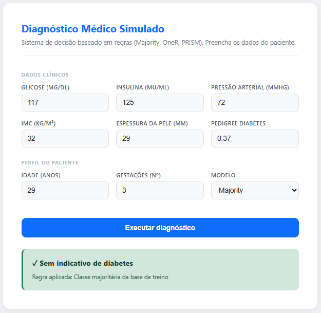
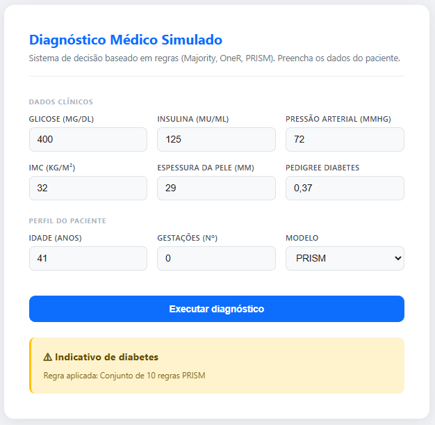

# 🧠 Diagnóstico Médico Baseado em Regras (Medical Rule-Based Diagnosis) – Sistema Especialista Didático

Projeto didático de sistema de decisão baseado em regras utilizando algoritmos clássicos de rule learning: Majority Classifier, OneR e PRISM, com interface web interativa e motor de inferência explicável.

Este projeto NÃO é um sistema médico real. Ele foi desenvolvido exclusivamente para fins educacionais e de portfólio em Ciência de Dados, IA explicável e Engenharia de Sistemas de Decisão.

---

## 📊 Base de Dados

Este sistema utiliza a base pública:
[**Pima Indians Diabetes Database**](https://www.kaggle.com/datasets/uciml/pima-indians-diabetes-database)

A base contém dados reais de pacientes e o diagnóstico verdadeiro (Outcome), com 8 atributos clínicos:

| Atributo | Descrição |
|---|---|
| Pregnancies | Número de gestações |
| Glucose | Concentração de glicose (mg/dL) |
| BloodPressure | Pressão arterial diastólica (mmHg) |
| SkinThickness | Espessura da dobra cutânea do tríceps (mm) |
| Insulin | Insulina sérica em 2h (µU/mL) |
| BMI | Índice de Massa Corporal (kg/m²) |
| DiabetesPedigreeFunction | Função de pedigree de diabetes (histórico familiar) |
| Age | Idade (anos) |

> **Tratamento de dados ausentes:** zeros nos atributos clínicos (Glucose, BloodPressure, SkinThickness, Insulin, BMI) são clinicamente impossíveis e representam dados ausentes. O sistema os substitui pela mediana antes do treinamento.

---

## 🎯 Proposta do Projeto

Demonstrar como sistemas de decisão explicáveis podem ser construídos a partir de dados reais utilizando algoritmos de indução de regras.

O objetivo é mostrar, de forma clara, a diferença entre:
- modelos que não aprendem nada
- modelos que aprendem regras simples
- modelos que constroem sistemas especialistas completos

---

## 🧠 Modelos Utilizados

### Majority Classifier

Classificador de baseline.
Ele não aprende padrões — apenas retorna sempre a classe mais comum da base.

Serve para demonstrar que uma boa acurácia pode esconder um modelo completamente inútil clinicamente.

---

### OneR (One Rule)

Algoritmo que testa cada atributo separadamente e escolhe aquele que gera a melhor regra única.

Os atributos contínuos são discretizados em 5 faixas (quantis). Para valores fora do intervalo de treinamento, o sistema aplica clipping automático — evitando erros silenciosos de predição.

Exemplo de regra aprendida:
> "SE Glucose está na faixa mais alta → diabetes = 1"

Mostra como uma única variável pode ser altamente informativa.

---

### PRISM

Algoritmo de indução de múltiplas regras baseado em probabilidade condicional.

Para evitar sobreajuste, o sistema aplica:
- **Discretização interna** de atributos contínuos em bins quantílicos
- **Suporte mínimo** (`min_support=0.03`): regras que cobrem menos de 3% das amostras são descartadas

Isso reduziu o conjunto de regras de mais de 380 para **10 regras significativas**, todas com confiança explícita.

Exemplo de regra gerada:
> `REGRA 6: SE Glucose == 4 ENTÃO diabetes (confiança: 75.70%)`

A predição seleciona a regra de maior confiança para cada paciente. Casos sem cobertura recebem a classe majoritária como padrão.

---

## 📈 Métricas de Avaliação

Resultados no conjunto de teste (30% dos dados, random_state=42):

| Modelo | Accuracy | Precision | Recall | F1 Score |
|---|---|---|---|---|
| Majority | 65.4% | 0.0% | 0.0% | 0.0% |
| OneR | **72.7%** | 64.9% | 46.2% | 54.0% |
| PRISM | **72.7%** | 64.9% | 46.2% | 54.0% |

> O Majority Classifier demonstra o paradoxo da acurácia: 65% de acerto sem aprender absolutamente nada, apenas predizendo a classe majoritária.

---

## 🧪 Como acontece o treinamento

O treinamento ocorre automaticamente no startup da API.

### Majority Classifier

O sistema analisa toda a base e identifica qual classe aparece com maior frequência. Essa classe é armazenada como resposta padrão.

### OneR

O algoritmo avalia cada atributo individualmente, cria faixas por quantis e calcula qual classe domina cada faixa. O atributo com menor erro global vira a regra principal.

### PRISM

O PRISM executa indução iterativa por classe: para cada classe-alvo, busca a condição atributo-valor que maximiza `P(classe | atributo=valor)`. A cada iteração, uma nova regra é criada e os exemplos cobertos são removidos do subconjunto. O processo encerra quando não há mais exemplos ou nenhuma condição atende o suporte mínimo.

Todas as regras aprendidas são exportadas automaticamente para `reports/rules.txt` — o **manual humano de decisão da IA**.

---

## ⚙️ Engenharia do Sistema

1. A API carrega o CSV, imputa dados ausentes e treina os modelos apenas uma vez no startup.
2. As regras aprendidas ficam em memória.
3. Cada requisição executa apenas inferência (lookup), garantindo respostas instantâneas.
4. Valores fora do intervalo de treinamento são tratados com segurança (clipping no OneR, bins com extremos ±∞ no PRISM).

---

## 🖥 Interface Web

O sistema possui interface web interativa com todos os 8 campos clínicos expostos ao usuário.

O usuário preenche os dados do paciente, escolhe o modelo (Majority, OneR ou PRISM) e executa o diagnóstico simulado. O resultado é exibido com destaque visual colorido e a regra aplicada.

### Exemplos de uso

### 🔹 Majority – Baseline


### 🔹 OneR – Regra Única


### 🔹 PRISM – Regras Combinadas


---

## ▶️ Como Executar

Instale dependências:
```
pip install fastapi uvicorn pandas scikit-learn
```

Inicie a aplicação:
```
uvicorn api.app:app --reload
```

Abra no navegador:
```
http://127.0.0.1:8000/ui/
```

---

## ⚠️ Aviso Importante

Este projeto é exclusivamente educacional.
Não deve ser utilizado para diagnósticos médicos reais.

Ele demonstra conceitos de:
- Explainable AI (XAI)
- Sistemas Especialistas
- Rule Learning
- Engenharia de Inferência
- Tratamento de dados ausentes

---

## 🧩 Conclusão

Este projeto demonstra na prática como:

• regras podem ser aprendidas automaticamente a partir de dados reais

• sistemas especialistas explicáveis podem ser construídos sem redes neurais

• motores de decisão humanos podem ser servidos via API com latência mínima

• overfitting em algoritmos simbólicos pode ser controlado com discretização e suporte mínimo

Transformando dados em regras, e regras em decisões explicáveis.
